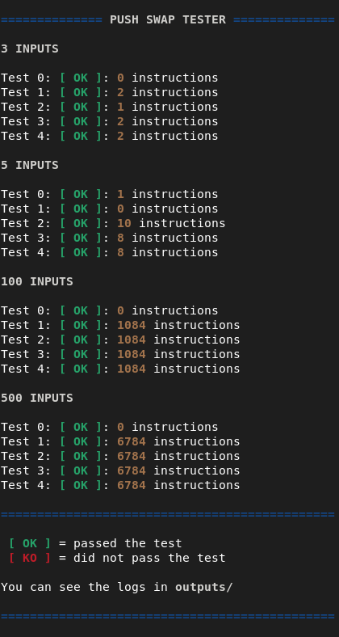

<h1 align="center">Push Swap Tester</h1>
<p align="center">Simple tester for the push_swap project of 42 school</p>

## ⚙️ Usage

### Installation


First you need to clone this repository inside your push_swap directory.

```shell
git clone https://github.com/mateusmedeir/PushSwapTester.git
```

Then download the checker for your OS and change its name to checker.

```shell
wget <Link to your OS checker>
```

And give permission to run the checker.

```shell
chmod +x checker
```

### Running script

Run the script inside the repository.

```shell
./tester.sh
```

### Output


